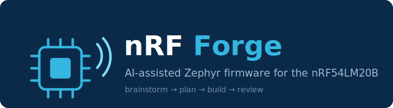

# nRF Forge

🔨 AI-assisted firmware development for the Nordic nRF54LM20B — describe behavior in plain language, ship production-quality Zephyr firmware without writing C by hand.



Inspired by [VGV Wingspan](https://github.com/VeryGoodOpenSource/vgv-wingspan), adapted for embedded development with the nRF Connect SDK.

## Installation

One-line install from your terminal:

```bash
claude plugin marketplace add <owner>/nrf-forge && claude plugin install nrf-forge
```

Or inside an active Claude Code session, run these as **two separate commands** (the second only after the first completes):

1. Add the marketplace:

   ```text
   /plugin marketplace add <owner>/nrf-forge
   ```

2. Install the plugin:

   ```text
   /plugin install nrf-forge
   ```

## Requirements

- nRF Connect SDK **v3.3.0** with the toolchain installed (`nrfutil sdk-manager install v3.3.0` or the nRF Connect for VS Code extension)
- An **nRF54LM20 DK** (board target `nrf54lm20dk/nrf54lm20b/cpuapp`) — custom boards are supported via the `nrf-custom-board` skill
- J-Link ≥ v9.24a for flashing

## Getting Started

nRF Forge follows a four-phase workflow: **brainstorm**, **plan**, **build**, and **review**. Each phase produces artifacts in `docs/` that feed into the next, so you can clear context between steps without losing work. Invoke skills explicitly or just describe what you need in natural language — the right skill triggers automatically.

### 0. `/nrf-new-project`

Starting from zero? Scaffold a sysbuild-ready NCS v3.3.0 application with a first clean build:

```text
/nrf-new-project air-quality-node
```

### 1. `/fw-brainstorm`

Describe the feature or problem — the more open-ended, the more value this adds:

```text
/fw-brainstorm the device should detect abnormal noise patterns and notify over BLE
```

A collaborative dialogue explores requirements, power budget, connectivity, and failure modes — in product terms, never in C jargon. Output saved to `docs/brainstorm/`.

### 2. `/fw-plan`

Turn the brainstorm into an actionable, step-by-step implementation plan — Kconfig, devicetree, modules, and verification criteria for every step:

```text
/fw-plan docs/brainstorm/2026-06-05-noise-detection.md
```

### 3. `/fw-build`

Execute the plan — write the C code, build with `west` after every step, flash, and run the quality gate:

```text
/fw-build docs/plan/2026-06-05-noise-detection.md
```

### 4. `/fw-review`

Automated review for memory safety and Zephyr/NCS best practices, on demand:

```text
/fw-review
```

## The Safety Net

Every line of generated C passes through two review agents before being declared done:

- **memory-safety-review-agent** — buffer overflows, NULL dereferences, use-after-free, stack overflows, ISR-safety violations. Strict: any critical finding fails the gate.
- **zephyr-review-agent** — devicetree discipline, Kconfig hygiene, threading model, logging, and power awareness.

A third agent, **ncs-research-agent**, keeps answers pinned to the official Nordic/Zephyr documentation for your exact SDK version instead of stale training data.

## Skills Reference

| Skill | Command | Description |
|-------|---------|-------------|
| **Brainstorm** | `/fw-brainstorm <feature or idea>` | Explore firmware requirements through collaborative dialogue |
| **Plan** | `/fw-plan <doc or description>` | Transform a brainstorm into a structured implementation plan |
| **Build** | `/fw-build <plan file path>` | Execute a plan — code, build, flash, quality gate |
| **Review** | `/fw-review [path]` | Run memory-safety and Zephyr-practice review agents on demand |
| **New Project** | `/nrf-new-project <name>` | Scaffold a sysbuild NCS v3.3.0 app with a first clean build |
| **Build & Flash** | `/nrf-build-flash [action]` | west build/flash, RTT logs, and build-error troubleshooting |
| **Devicetree** | `/nrf-devicetree <peripheral>` | Wire sensors and peripherals (I2C, SPI, ADC, PDM, GPIO) via overlays |
| **BLE** | `/nrf-ble <feature>` | GATT services, advertising, central/peripheral and dual-role, security |
| **DFU / OTA** | `/nrf-dfu [transport]` | Secure updates: MCUboot, ED25519 signing, KMU key provisioning |
| **Power** | `/nrf-power <concern>` | Power budgeting, duty cycling, peripheral suspension, PPK2 measurement |
| **Custom Board** | `/nrf-custom-board <task>` | Out-of-tree board definition and hardware bring-up sequence |
| **Edge AI** | `/nrf-edge-ai <task>` | On-device ML: Axon NPU, FLPR coprocessor, TFLite Micro |

## Design Principles

- **You describe behavior, the AI owns the C.** Decisions are explained as product trade-offs (battery, range, latency) — never pointer mechanics.
- **Always buildable.** The firmware compiles after every step; warnings are defects.
- **Hardware behind devicetree.** All hardware access goes through overlays and Kconfig, never SDK edits — porting from the DK to your own PCB stays cheap.
- **Measured, not guessed.** Power claims require PPK2 numbers; DFU isn't done until the failure paths pass.

### Tips

- **Clear context between phases.** Each phase ends by offering the next step — a fresh context window produces better results.
- **You can skip phases.** Simple change? Go straight to `/fw-build` with a description. Know what you want? Start at `/fw-plan`.
- **Pin your SDK version.** The skills assume NCS v3.3.0; if you upgrade, the research agent will resolve API differences against the new docs.

## License

MIT
